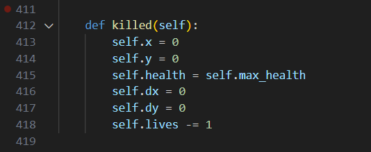

# Dodging Balls

    Turtle Python Shooting and Dodgings the color balls game.

# In-game Features :
    Featureing game functions.
## "Pre-game"
    Game Title on right corner.
    Actions Input on the left side which contains.
     - Press Q to Confirm
     - Press W to Move forward
     - Press A or D to Turn lefr or Right
     - Press S to Slow down
     - Press space to Shoot
     - Press R to Change mode
    And, Start Button.

    
## "In-game"
    The screen.
     - white game border
     - current score
     - current wave
     - current gun mode

    The entity.
     - player : white triangle 
     - Enmies : color circle
     - Heal   : green square
     - Bullet : yellow square

## "End-game"
    Game Over screen.
    Game score display.
    Game Hi-score display.
    And return to Pre-Game screen by press Q.

 

# Installation Steps :
    1. Download both Alphabet.py and Main.py.
    2. Run the Alphabet.py first.
    3. Then run Main.py to play the game.

<video controls src="Samples/Preview.mp4" title="Title"></video>

# All the controls :
    Q : Press to confirm into game or 
        return to mainmenu when gameover.
    A : Turn left.
    D : Turn right.
    W : Move forward.
    S : Slowdown.
    R : Switch gun mode between "Single" and "Spread".
        Spacebar : To shoot.

# Project design and implementation :

    

    There are 7 classes:
     - Alphabet
     - Game
     - Entity
     - Player(Entity)
     - Bullet(Entity)
     - Enemy(Entity)
     - Powerups(Entity)

    Let me break it down for you.

## class Alphabet:

    This class have seperate file from other classes.

    Let's start with __init__

    Implement by giving it color and, scale.

    The characters is how the characters being drawn.
    For Example : 

    

    And the function inside are all related to
    the screen writing and, texts in the game.

    The writing and, texts center are the position.

 

    Both are the base of this class.

    They generate and write a text that later
    be used all over the places.

    Down here are the screen that display gameover and stuffs.

## class Game:

    Opening the game, This class.
    Updating the game, This class.
    Setting the player, This class.
    Collecting game data, also This class.
    But I didn't make run() function into this class.
    In fact, the game did run by using this class.

    This class have a massive data.

    This one generate turtle screen, pen, and data.

    Function start is used everytime when the game start or
    enter the new wave.

    It generate bullets, enemies, and powerups then append to
    the game list.

    Function border_render and info_render these are activated
    when the game enter "playing" state and its name tell what it do.

    This use to restart by changing the game state.

    This pair with Q key.

## class Entity:

    I didn't seperate this class from main class due to my own sanity limit.

    This class are used by almost everything in this game.
    
    From creating to update and rendering.

    Making the health bar and checking hitboxes also.

    The bounce_off function is a mess.

    The function can't simulate a good elastic collision.

    But the border_check work like a charm. 

    Let me introduce to the powerhouse of this game.

    Function render and update.

    These functions will determine what previous function
    will be used and shown in the screen.

    These also make movement happend.

### class Player(Entity):
    
    This class contain everything related to Entity and have
    its own addon for itself.

    The movements related function that pair with the keys.

    The same as above.

    It switch the mode that will work with bullet class.

    This function was purely for cosmetic.

    It create and update when the gun is ready.

    Another powerhouse for the game.

    I have it to override the original function.
    Because this have extra render it needed.

    POV : me in the final exam.

    Use to indicate gameover.

### class Bullet(Entity):

    The bullet is drawn and set by turtle.

    These are the same as above.
    An extra addon.

    Another one the same as before.

    But function update has extra, I'll called it fuel.
    This set how long can bullet travel and exist.

    Pair with fire function by set it status to "active",
    Then do the job till its dead the set it to "ready",
    To prevent the stray shot.

### class Enemy(Entity):

    The red dot that make you dead.

    Have 4 different types,
     - The normal
     - The immoveable
     - The fast
     - The elite

    They all have minor different in stats.

    Function random enemy types with some rarity.

    Likely the same.

    But it was program to kill lick yo ass.
    It also move weirdly whan at the same x or y as player.

    When it get shot or being dead it inactivate itself
    and give you points.

### class Powerups(Entity):

    Set up like another enemy with no tracking system.

    Roam free with no free will
    and the only thing it does is heal you.

    I override all the update and render in every subclass.

    This one have no health bar. so, different render method.

# Afterwords :

    First of all.

    I use these videos as a reference.
    
    https://www.youtube.com/watch?v=nUoJjHOlY24&list=PLlEgNdBJEO-kK78GXDVzytiZlJtCyiFyW

    From Rate your project sophistication level.

    I'd request for 90

